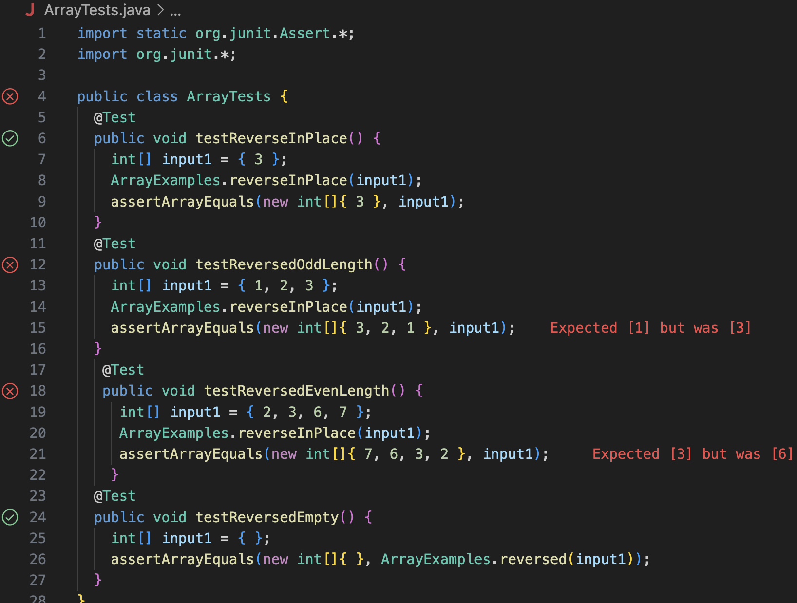

# CSE15L Lab Report 3
---
## Part 1: Bugs
A failure-inducing input for the buggy program, as a JUnit test and any associated code (write it as a code block in Markdown)
```
# code block of two failed tests from ArrayTests.java
@Test
  public void testReversedOddLength() {
    int[] input1 = { 1, 2, 3 };
    ArrayExamples.reverseInPlace(input1);
    assertArrayEquals(new int[]{ 3, 2, 1 }, input1);
  }
   @Test
   public void testReversedEvenLength() {
     int[] input1 = { 2, 3, 6, 7 };
     ArrayExamples.reverseInPlace(input1);
     assertArrayEquals(new int[]{ 7, 6, 3, 2 }, input1); 
    }
```
*An input that doesn't induce a failure, as a JUnit test and any associated code (write it as a code block in Markdown)*
```
# code block of JUnit test that passes
@Test 
	public void testReverseInPlace() {
    int[] input1 = { 3 };
    ArrayExamples.reverseInPlace(input1);
    assertArrayEquals(new int[]{ 3 }, input1);
	}
```
*The symptom, as the output of running the tests (provide it as a screenshot of running JUnit with at least the two inputs above)*

- In this screenshot, the symptoms in testReversedOddLength and testReversedEvenLength reveal that an element in the array has caused the failure due to a mismatch in expected vs the actual output.
*The bug, as the before-and-after code change required to fix it (as two code blocks in Markdown)*
```
# code block of bug
static void reverseInPlace(int[] arr) {
    for(int i = 0; i < arr.length; i += 1) {
      arr[i] = arr[arr.length - i - 1];
    }
}
```
- The bug is in the for loop as it forgets to copy the first half of the array to place it in the back half.
```
# code block of bug fixed
static void reverseInPlace(int[] arr) {
    for(int i = 0; i < arr.length/2; i += 1) {
      int temp = arr[arr.length - i - 1];
      arr[arr.length - i - 1] = arr[i];
      arr[i] = temp;
    }
  }
```
- First, I changed the for loop to iterate until arr.length/2 since it will swap elements from the half. Furthermore, by making a temp variable, it is set to save the front half array, which now allows for the elements from the front half of array to be copied to the back half.
